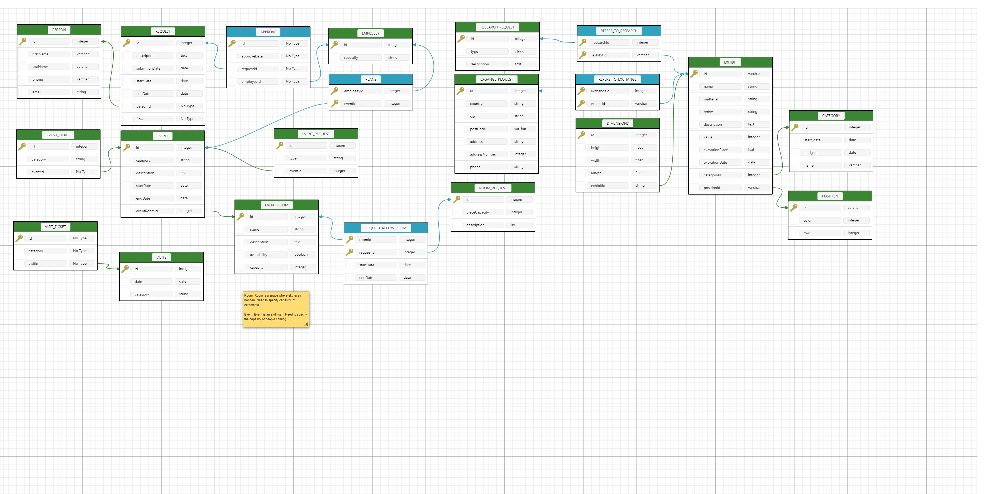

# Archeological Museum Database Handler

Σκοπός της παρούσας εργασίας είναι ο σχεδιασμός-δημιουργία μίας βάσης δεδομένων για την οργάνωση και σωστή λειτουργία ενός αρχαιολογικού μουσείου καθώς και η δημιουργία μίας εφαρμογής (με τη χρήση της γλώσσας Python), η οποία θα υλοποιεί τυπικά σενάρια χρήσης της βάσης μας. 

## File Structure
- The ```db_handler.py``` is a custom library based on abstractions in order to make easy the CRUD implementation. It also implements custom queries for more practical purposes.
- The ```ui.py``` is the main python script that launches the GUI for the handler. Via this GUI anyone can perform CRUD operation with ease for everything in the database
- The ```timer.py``` is a custom library that with the help of annotations we time each of the CRUD functions and simultaneously keep the code clean.

## Installation
After installing python 3.6 and above execute the following command:

```
pip install -r requirements.txt
```

## Περιγραφή μικρόκοσμου

Ζητείται να σχεδιαστεί βάση δεδομένων για την ορθή λειτουργία ενός αρχαιολογικού μουσείου. Σκοπός η διαχείριση εκθεμάτων, εκδηλώσεων και αιτημάτων. Αναλυτικότερα ένα έκθεμα περιγράφεται από το όνομά του, το χρόνο και ΄χώρο δημιουργίας και ανασκαφής και αρκετά άλλα γνωρίσματα. Ανήκει σε κατηγορία που αφορά χρονική περίοδο την οποία δημιουργήθηκε, βρίσκεται σε μία συγκεκριμένη θέση (χώρος ή αποθήκη) στο μουσείο και μπορεί να αφορά αίτημα προς ανταλλαγή ή μελέτη. Επίσης χαρακτηρίζεται από διαστάσεις και η θέση του ορίζεται από σειρές και στήλες προκαθορισμένες από την αρχιτεκτονική του μουσείου. Παράλληλα, σε ένα μουσείο δημιουργούνται, επεξεργάζονται και εγκρίνονται αιτήματα από το προσωπικό του μουσείου σχετικά με την οργάνωση εκδηλώσεων, την μελέτη και δανεισμό εκθεμάτων και την δέσμευση χώρων του μουσείου. Στην συνέχεια το μουσείο έχει χώρους στους οποίους μπορούν να λάβουν χώρα εκδηλώσεις και εκθέσεις καλλιτεχνικού τύπου οι οποίες είναι υπό την επιμέλεια προσωπικού του μουσείου. Τέλος, γίνεται διαχείριση των εισιτηρίων που εκδίδονται για εκδηλώσεις και επισκέψεις. Να οριστούν οι βασικές έννοιες (οντότητες), τα χαρακτηριστικά τους γνωρίσματα και οι συσχετίσεις τους.

## ERD


## Table Schema



## Οδηγίες χρήσης προγράμματος
Τρέχοντας το πρόγραμμα ui.py, εμφανίζεται η γραφική διεπαφή. Εμφανίζεται ένα παράθυρο στο οποίο περιέχονται εννιά κουμπιά και ένα drop-down list. Στο drop-down list απεικονίζονται όλοι οι πίνακες τους οποίους μπορεί να διαχειριστεί ο χρήστης. Αφού γίνει η επιλογή του, με τα τέσσερα κουμπιά Create, Read, Update και Delete μπορεί να εκτελέσει όλες τις CRUD διεργασίες σε ένα καινούργιο window. Έχει την δυνατότητα να επιστέψει στο αρχικό παράθυρο με το κουμπί Exit. Παράλληλα υπάρχουν άλλα τέσσερα κουμπιά Exhibit By Category, Exhibit Position, Event Categories και Exhibit Categories, με τα οποία ο χρήστης μπορεί να εκτελέσει ενδεικτικές λειτουργίες της εφαρμογής. Τέλος, με το κουμπί Exit από το main window, ο χρήστης μπορεί να τερματίσει την εφαρμογή.
